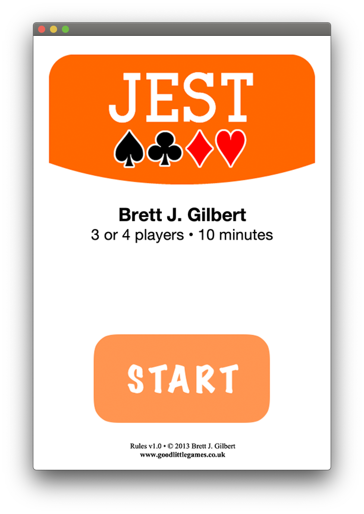

# Jest_ProjetDEMO

<u>"Jest" est un jeu de carte avec GUI, développé en utilisant Java.</u>

**Date de début** : septembre 2019

**Date de fin** : janvier 2020

## Description générale

Le projet "Jest" est 	un projet Java d'enseignement pendant mes études à l'Université de Technologie de Troyes.
Mon partenaire et moi ont établi un jeu de carte avec Graphical User Interface.
J'ai eu la mention "A" à la fin du semestre.
(À la demande de l'équipe pédagogique, je ne peux pas mettre des codes sources public sur l'internet.) 